# Quant Arena — Architecture

**A simulated stock exchange.** Users get virtual money, place buy and sell orders on invented
companies, and a matching engine pairs them up — exactly the way a real exchange does.

This document explains how the system is built and why. It assumes no prior knowledge of trading.

---

## 1. What the system actually does

Imagine a room full of people who want to buy and sell cricket cards. Everyone shouts at once, so
nobody can agree on a price. The room hires a clerk.

Now nobody shouts. Everyone writes their offer on a slip and hands it to the clerk:

> "I will BUY 10 cards, but I will not pay more than ₹100 each."
>
> "I will SELL 15 cards, but I will not accept less than ₹102 each."

The clerk keeps all the slips on a board, sorted. When a buyer's slip and a seller's slip fit
together, the clerk pairs them, announces the trade, and updates the board.

**That clerk is Quant Arena.** The cards are made-up companies. The money is fake. Everything else
works like a real exchange.

### The board is called an order book

Here is the board for a made-up company called `QA-TECH`:

```
        BUYERS                    |            SELLERS
   (will pay at most)             |        (want at least)
  ────────────────────────────────┼──────────────────────────────
   ₹100  ×  50 units              |   ₹102  ×  30 units
   ₹ 99  ×  120 units             |   ₹103  ×  80 units
   ₹ 98  ×  200 units             |   ₹105  ×  40 units
```

Read this carefully, because it is the heart of the whole system:

- The best buyer will pay **₹100**. The best seller wants **₹102**.
- ₹100 is less than ₹102, so **nothing happens**. Everyone waits.
- That ₹2 gap is called the **spread**.

Here is the important idea: **nobody decides the price.** There is no admin typing it in and no
outside service being asked. The price is simply whatever number two people last agreed on. It
comes out of the board on its own.

---

## 2. The big picture

The system is **one project, split into separate programs, sharing one flow of events.**

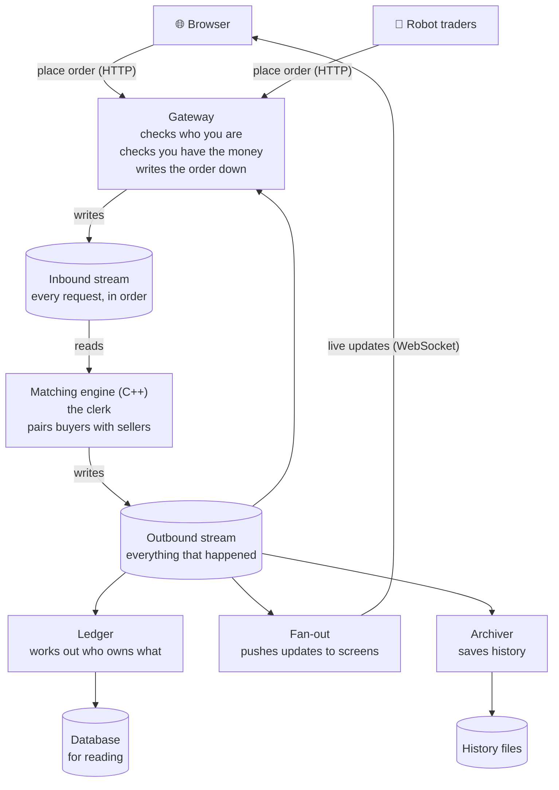

### Why separate programs?

Not because it is fashionable. Each one has a genuinely different job:

| Program | Its job | Why it cannot share a program with the others |
|---|---|---|
| **Gateway** | Accept requests, check them, write them down | Must be fast and steady. If it gets busy, orders get delayed |
| **Engine** | Match buyers with sellers | Must never wait for anything — no network, no database, no disk |
| **Fan-out** | Push updates to browsers | Gets slower as more people connect. Must not drag the engine down with it |
| **Ledger** | Work out balances | Talks to a database, which is slow. Belongs off the fast path |

**This is not "microservices."** There is one repository, one version, and everything is deployed
together. The programs are split by *how they need to run*, not by business area. And they all
share one flow of events, so there is nothing to keep in sync between them.

---

## 3. The one idea everything rests on

> **Every single thing that happens goes into one ordered list, and everything else is worked out
> from that list.**

That list is called the **event stream**. Think of it as a notebook where every line is numbered
and nothing is ever erased.

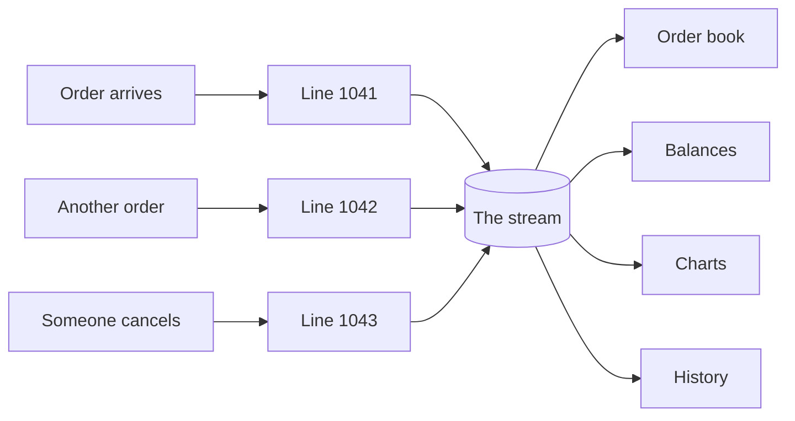

This single choice gives us four things at once:

1. **Fairness.** Everyone agrees on what happened first, because there is one numbered list.
2. **Repeatability.** Read the list again from the top and you get exactly the same result.
3. **Recovery.** If a program crashes, it reads the list again and catches up. There is no special
   recovery code — it is the same code it always runs.
4. **Nothing slows down trading.** Charts, history, and balances all just read the list. They
   cannot get in the way of matching, because they are not in the path.

We use **Redis Streams** for this. Redis is a fast data store, and a "stream" in Redis is exactly
this kind of numbered, append-only list.

---

## 4. Following one order all the way through

Riya has ₹1,00,000 of virtual money. She wants to buy 50 units of `QA-TECH` at ₹102 or less.

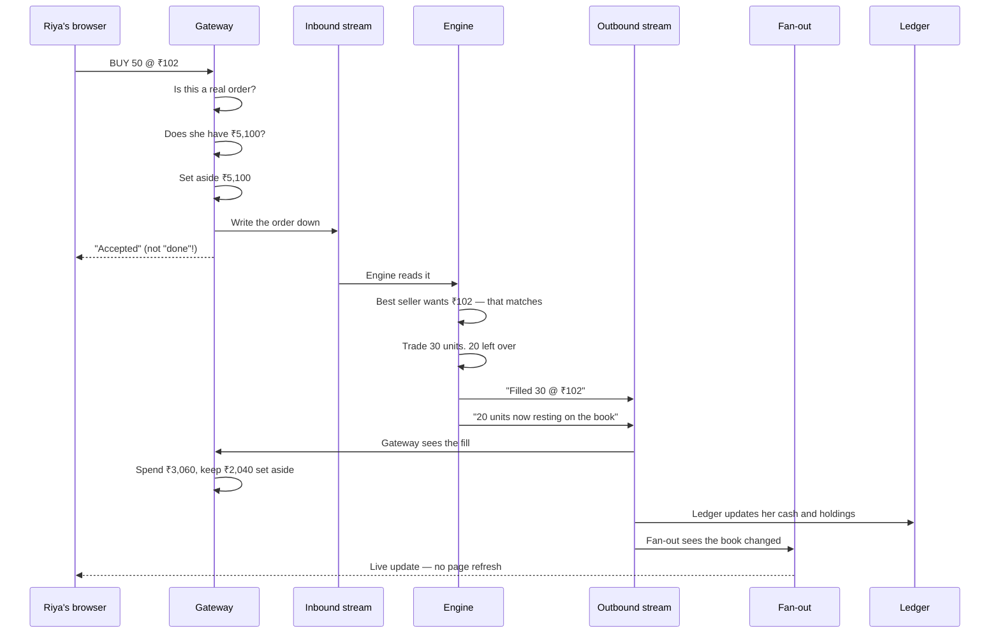

### What happened, step by step

**1. Is this a real order?** The gateway checks the numbers make sense — sensible quantity, price
on the right grid, a symbol that exists.

**2. Can she afford it?** 50 × ₹102 = ₹5,100. She has ₹1,00,000. Yes.

**3. Set the money aside immediately.** This is important, and section 6 explains why.

**4. Write it down.** The order goes into the inbound stream and gets line number 1041.

**5. Tell Riya "accepted", not "done".** The order has been safely recorded. Whether it *trades*
is a separate question, and the answer arrives a moment later. Real exchanges work this way too.

**6. The engine matches it.** Riya will pay up to ₹102. The best seller is asking exactly ₹102 and
has 30 units. That matches — 30 units trade.

**7. She wanted 50 but got 30.** This is called a **partial fill** and is completely normal. The
remaining 20 join the board as a new buy order, and now she is the best buyer:

```
        BUYERS                    |            SELLERS
  ────────────────────────────────┼──────────────────────────────
   ₹102  ×  20   ← Riya's rest    |   ₹103  ×  80 units
   ₹100  ×  50                    |   ₹105  ×  40 units
   ₹ 99  ×  120                   |
```

The ₹102 sellers are gone — Riya bought them all. The price of `QA-TECH` just moved from about
₹100 to ₹102.

**8. Everyone finds out.** Riya's screen shows the fill and her new balance. The seller's screen
shows the sale. Everyone watching `QA-TECH` sees the board redraw and a new point on the chart.
Nobody pressed refresh.

---

## 5. How the matching engine decides

The engine is the only part written in **C++**. It is also the only part that does no reading or
writing of anything — no network, no database, no files. Orders go in, results come out. That is
what makes it both fast and easy to test.

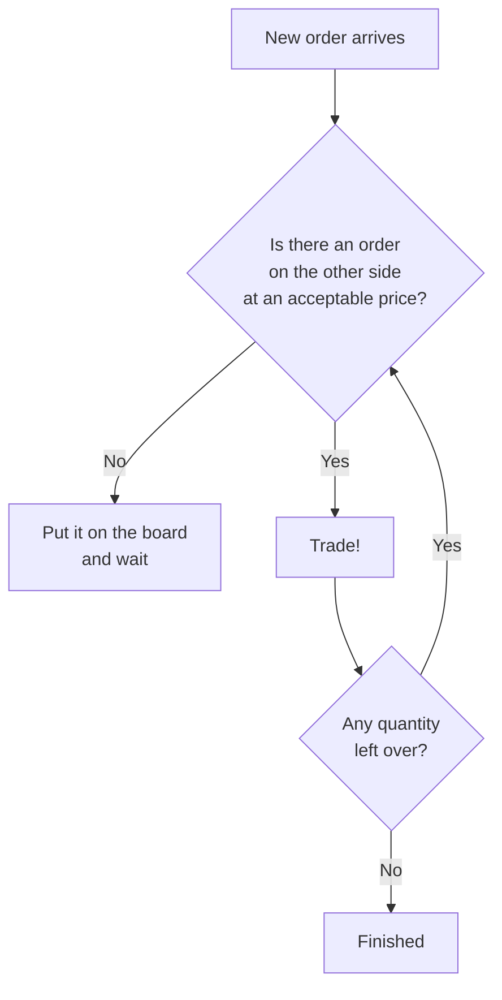

### The one rule that keeps it fair

Two people want to buy at the same price. Only one seller shows up. Who wins?

> **Better price first. If prices are equal, whoever arrived first.**

This is called **price-time priority**, and it is the rule real exchanges use. It is also why the
order in which things are processed genuinely matters — if the clerk shuffles the slips, somebody
gets cheated. A large part of the engineering effort goes into guaranteeing the clerk never
shuffles.

### Market orders

A **market order** says "buy now at whatever the going price is." That is dangerous when the board
is thin — a big market order could sweep up to an absurd price.

So we turn every market order into a limit order with a safety band. A market buy becomes "buy at
up to 5% above the current best offer." Real exchanges do exactly this, and they call it a
**price band**.

---

## 6. How the money stays correct

This is the part most likely to go wrong, so it gets a section of its own.

### The problem

The ledger works out balances by reading the event stream. That means it is always slightly
behind. Now watch what goes wrong if the gateway asks the ledger "can she afford this?":

```
Riya has ₹5,000.

10:00:00.001   Order A: buy ₹5,000 worth.  Ledger says she has ₹5,000. Allowed.
10:00:00.002   Order B: buy ₹5,000 worth.  Ledger STILL says ₹5,000. Allowed.
10:00:00.010   Both orders fill.
10:00:00.015   Balance: −₹5,000
```

**Money was created out of nothing.** This would never show up in hand testing. It would show up
immediately once robot traders start firing hundreds of orders a second.

### The fix

The gateway keeps its own running total in memory, and **sets money aside the moment an order is
accepted** — before the order goes anywhere.

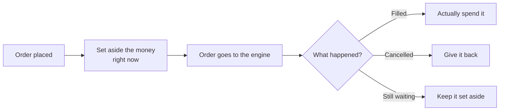

Why this is safe: the gateway is a **single program doing one thing at a time**. There is no way
for two orders to slip past each other, because there is nothing to slip past. The safety comes
from one program owning the answer, not from checking harder.

And when the gateway is briefly behind, it is behind in the **safe direction** — it thinks you have
*less* money than you do, never more. Being too strict for a few milliseconds is fine. Being too
generous is not.

Two nice things fall out of this with no extra work:

- **Buying cheaper than expected refunds itself.** You offered ₹102 and got filled at ₹101? We set
  aside ₹102 and spent ₹101, so ₹1 comes back automatically.
- **Cancelling only releases money when the engine confirms it.** If your cancel arrives a moment
  too late and the order already traded, nothing is released — which is correct.

### Where money actually lives

| Place | Is it the truth? |
|---|---|
| The event stream | **Yes.** Every rupee can be explained by reading the stream |
| The database | **No.** It is a convenient copy for showing account pages and history |
| The engine | Does not know money exists at all |

If the database ever disagrees with the stream, the stream wins and the database gets rebuilt.

---

## 7. Sending updates to thousands of screens

Here is the arithmetic that shapes this whole part of the system:

```
20,000 events per second  ×  500 people watching  =  10,000,000 messages per second
```

That is impossible. So the design problem is not *"how do we send messages quickly."* It is
**"what do we decide not to send."**

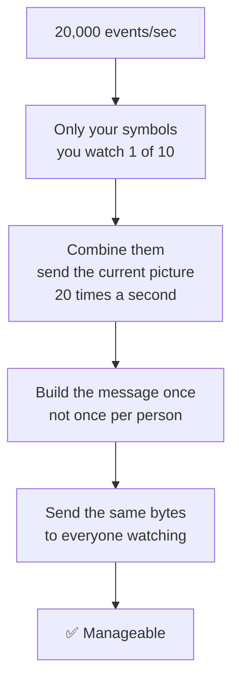

### Combining updates is the big win

Your screen updates 20 times a second. Anything faster is invisible to a human eye anyway. So
instead of sending every single change, we wait 1/20th of a second, then send **the current state
of the board**.

| Trick | How much it helps |
|---|---|
| Only send symbols you are watching | 10× less |
| **Combine updates, 20 per second** | **85× less** |
| Build the message once, send to all | 500× less work for the computer |
| Use a compact format instead of text | 5× less |

Notice the order. Combining updates helps 85 times more than switching to a compact data format.
That is why we do the simple thing first and only reach for a compact format later, if measurements
show we need it.

### A pleasant side effect

Because each message is a **complete picture of the board** rather than a list of changes, a
message that gets lost does not matter — the next one fixes everything.

So when someone's connection is slow, we simply skip them for that round. They get a slower
picture, and they cannot slow anyone else down. A decision made for speed also removed an entire
class of bug.

### Two kinds of messages

| | Market data | Your private data |
|---|---|---|
| What | The board, trades, prices | Your fills, your balance |
| Who sees it | Everyone watching that symbol | Only you |
| Can we drop one? | **Yes** — the next one replaces it | **No** — a missed fill means a wrong screen |

Your private messages are numbered, so if your browser notices a gap it can ask the server for a
fresh copy.

---

## 8. What happens when something crashes

Software crashes. The question is what happens next.

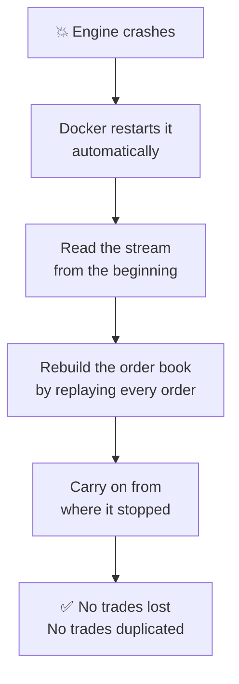

The neat part: **this is the same code the engine always runs.** Its normal job is "read events
from the stream and apply them." Recovery is that same loop, just starting further back. There is
no separate recovery code that could quietly stop matching the real code.

We prove this works rather than claiming it. There is a script that starts everything, floods it
with orders, kills the engine mid-flight, waits, and then checks that not a single trade was lost
or counted twice.

### Making sure nothing is lost before the crash

An order is only ever confirmed to the user **after** it is safely written to disk. If the machine
loses power one microsecond before that, the order simply never existed — the user never saw a
confirmation. There is no window where you are told "done" and it turns out not to be.

### If Redis goes down

Redis holds the event stream, so if it is unreachable, no orders can be accepted. That has to fail
**loudly**: the system enters a visible "exchange halted" state and rejects new orders with a clear
reason. Real exchanges halt too. What we must never do is quietly accept orders we cannot record.

---

## 9. Where the market comes from

With three friends using the site, the board would be empty and nothing would ever trade. Boring,
and it would not prove anything.

So we write **robot traders**. As far as the exchange is concerned they are ordinary users — they
log in and place orders through the same API as everybody else.

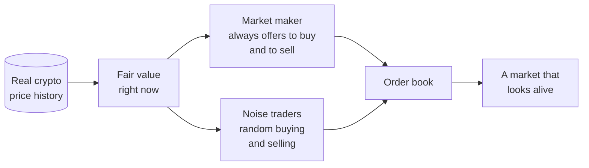

### Where the prices come from

Rather than inventing price movements, we replay **real historical crypto prices** and use them as
the "true value" the robots quote around. Real prices come with real behaviour for free: quiet
periods, sudden jumps, trends, and calm stretches.

Two details worth knowing:

- The real prices drive **made-up company names**, not real ones. Nobody should think they are
  trading real Bitcoin.
- We speed up time. **One real second is one simulated minute**, so a demo feels alive instead of
  moving once a minute.

### The market maker

This is the most important robot. It always offers both to buy and to sell, a little below and a
little above fair value. That is what guarantees there is always somebody to trade with.

It also **leans against its own position**. If it has accidentally bought a lot, it starts quoting
more attractively on the sell side to get rid of it. Without this the robot slowly accumulates a
huge one-sided pile and stops being able to quote at all.

Real exchanges register these as **designated market makers** and give them privileges in exchange
for obligations — they must keep quoting, within a maximum spread, most of the time. We do the
same, and we measure whether ours keeps its promises.

### The robots do three jobs

1. They make the market look alive, which is what makes a demo possible.
2. They are the **load generator** for performance testing — real clients hammering the real API.
3. They generate **history**, which the research tools can then study.

---

## 10. Testing a trading idea

Someone has an idea:

> "Buy when the recent average price rises above the longer-term average. Sell when it falls back."

**Backtesting** means replaying past prices, pretending to follow that rule, and reporting what
would have happened.

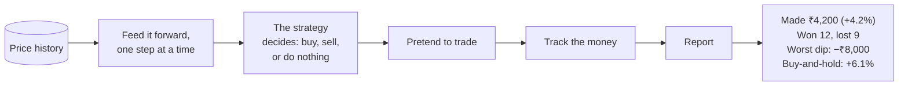

Two design choices matter more than they look:

**Prices are fed forward one step at a time.** The strategy is physically unable to see tomorrow's
price, because it has not been handed to it yet. Accidentally peeking at the future is the single
most common way a backtest ends up silently wrong, so we make it impossible rather than telling
people not to do it.

**Every report compares against simply buying and holding.** A strategy that made 8% in a market
that rose 20% actually lost money in the only sense that matters. Reporting the 8% on its own hides
that.

### Being honest about the limits

In Phase 1 we simulate trades at the next time-step's opening price. That ignores the spread and
ignores whether anyone was actually available to trade with. **It makes strategies look better than
they really are**, especially ones that trade often.

We say so, plainly, on the report itself. Phase 2 replaces it with something much better — replaying
the actual order book and running the strategy's orders through the *real* matching engine, so the
simulated trades follow exactly the same rules as live ones.

---

## 11. How we know the exchange is correct

"We wrote some tests" is not a claim — everybody says it.

The difficulty here is that when an exchange goes wrong, it does not crash. It quietly produces a
**believable but wrong answer**: an order skipped in the queue, a trade of the wrong size, a
cancelled order that trades anyway. Nothing throws an error. The numbers are just wrong.

So we do something stronger. We write the engine **twice**.

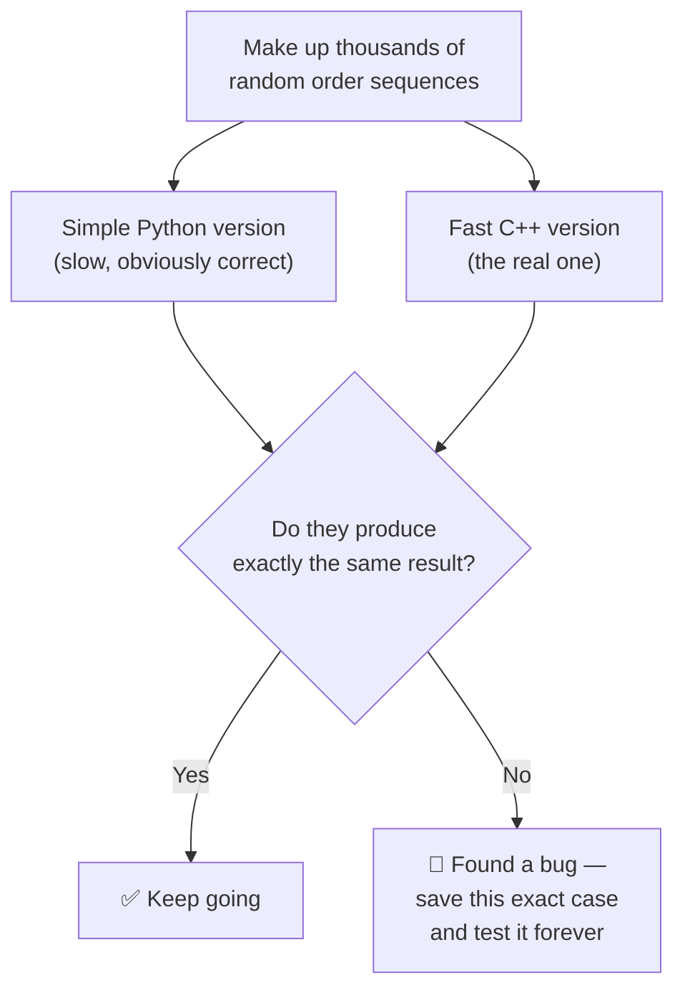

The Python version is deliberately slow and stupid — it keeps everything in a plain list and
re-sorts it constantly. That is the point: it is short enough to read carefully and be sure it is
right. The C++ version is fast and complicated. If they ever disagree, something is broken.

### Rules that must always hold

On top of that, we check a set of statements that must be true after **every single operation**,
across thousands of randomly generated scenarios:

| | Must always be true |
|---|---|
| 1 | The best buy price is never higher than the best sell price |
| 2 | Units are never created or destroyed |
| 3 | A trade never exceeds what either side asked for |
| 4 | A cancelled order never trades |
| 5 | **Nobody's order is ever skipped in the queue** |
| 6 | Total money in the system never changes, except when we hand out virtual capital |
| 7 | Nobody's balance ever goes negative |
| 8 | Replaying the whole history reproduces exactly today's balances |

Rule 6 is the one that catches the money bug from section 6 automatically, the very first time it
happens.

Rule 5 is the hardest to check, because it is a statement about something that *did not* happen. It
needs a separate checker that watches every trade and confirms no better or earlier order was
passed over.

---

## 12. Measuring speed honestly

`README.md` asks us to measure performance rather than claim it. That is a higher bar than it
sounds, because the usual way of measuring is quietly wrong.

### The trap

Most simple load-testing tools send a request, wait for the reply, then send the next one. Now
suppose the server freezes for 200 milliseconds. **The tester freezes too.** It never sends the
requests that should have gone out during the freeze, so it never records how slow they would have
been. The freeze vanishes from the results.

The reported numbers look excellent. Real users had a terrible time.

So our load generator sends requests **on a fixed schedule regardless of whether earlier ones have
finished**, and measures each one from when it *should* have been sent. If the system falls behind,
the numbers show it.

### Two separate numbers, never mixed

| Number | What it measures |
|---|---|
| **Engine speed** | The C++ engine alone, no network, no Python. Over 500,000 orders per second |
| **Whole-system speed** | A real request in, a real update out, everything in between |

The second is much lower than the first, and **that gap is the most interesting thing in the whole
report** — explaining it is the actual performance story. Publishing only the big number would be
dishonest.

### Two findings worth expecting

1. **The matching engine accounts for roughly 0.002% of the total time.** The part we optimised
   hardest matters least to the user.
2. **Combining updates 20 times a second dominates everything else** — by a factor of about a
   thousand. That was a deliberate choice for how the demo feels, and the report says so rather
   than hiding it.

### Finding out what happened to one order

Because every order carries an ID and every event references it, we can reconstruct an order's
entire journey — through each program, with timings — by simply reading the stream back. A small
tool does this.

This is the same thing that big "distributed tracing" systems provide, except we get it for free
from the design. We chose not to add one of those systems, because the stream already is the trace.

---

## 13. Technology used

| Part | Technology | Why |
|---|---|---|
| Matching engine | **C++20** | The one piece with no waiting on anything, so it can be genuinely fast |
| Engine ↔ Python bridge | **nanobind** | Lets tests and the backtester drive the real engine directly |
| Backend | **Python**, **FastAPI** | Fast to build, good at handling many connections at once |
| Event stream | **Redis Streams** | An ordered, numbered, append-only list — exactly what we need |
| Read-only copy of data | **PostgreSQL**, **SQLModel** | For account pages and history. Never the source of truth |
| Live updates | **WebSocket** | Keeps a connection open so the server can push |
| Frontend | **React**, **TypeScript**, **Vite** | Standard, well documented, easy to hire for |
| Charts | **TradingView Lightweight Charts** | Built for exactly this kind of streaming price data |
| History files | **Parquet** | Compact, and quick to read large amounts of |
| Testing | **pytest**, **Hypothesis**, **Catch2** | Hypothesis is what generates the thousands of random test cases |
| Packaging | **Docker**, **docker-compose** | One command starts everything, on any machine |
| Automation | **GitHub Actions** | Runs the tests on every change |

### Things we deliberately did not use

Each of these is a decision with a reason, not an oversight. These are also exactly the questions
an interviewer is likely to ask.

| Not used | Why not |
|---|---|
| **Kafka** | Its core idea is a numbered append-only list, which Redis Streams already gives us. Kafka adds a whole extra server and a network hop to solve problems we do not have — we have one writer, on one machine |
| **Kubernetes** | Weeks of work for two people, solving a scaling problem this system does not have |
| **Protobuf** | Our records are just fixed-size numbers. A general-purpose format would cost complexity and give nothing back |
| **OpenTelemetry** | The event stream already lets us trace any order. Adding a tracing product would duplicate what the design provides |
| **Prometheus / Grafana** | Live dashboards are for operations teams. What we need is a written report, which we generate from saved data instead |
| **JWT tokens** | Solve a problem we do not have (checking logins across many separate services). Ordinary session cookies are safer here — a browser script cannot read them |

---

## 14. What is built when

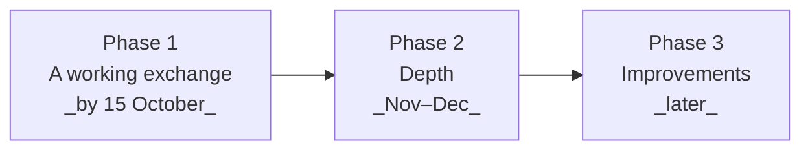

### Phase 1 — a working exchange

Everything described above. Accounts and virtual money · limit and market orders · cancellation ·
partial fills · the C++ matching engine · durable event stream and crash recovery · ten symbols
driven by real crypto prices · robot traders · a live trading screen · a simple backtester ·
the full test suite · a benchmark report · deployed and reachable.

### Phase 2 — depth

- **Realistic backtest trading** — replay the actual order book and run strategies through the real
  engine, then publish how much the results changed
- **Users writing their own strategies**, safely isolated so a broken one cannot affect anyone else
- **Competitions**, scored on return adjusted for risk
- Better charts, more built-in strategies, more sophisticated robots
- Analytics as a genuinely separate service
- Borrowing and short selling, which needs a real risk system

### Phase 3 — improvements

Each one a self-contained project with a measurable result: replacing Redis with a hand-written
shared-memory log and publishing the speed difference · splitting the engine across CPU cores ·
running several gateways at once · a full-depth market data feed · modelling how large orders move
the price.

### Never

Real money. Connecting to a real stock exchange.

---

## 15. In one paragraph

**Quant Arena is a fake stock exchange that behaves like a real one.** Users get virtual money and
place buy and sell orders on invented companies. A matching engine pairs compatible orders using
price-time priority, executes trades, and updates everyone's screen instantly. Robot traders keep
the market liquid. Every trade is recorded, so users can later test trading strategies against
market history.

The reason it is a serious engineering project and not a toy: **it has to be correct.** Money
cannot appear or vanish. The same sequence of orders must always produce the same trades. No
order can be skipped or counted twice. If a program crashes mid-trade, the system has to come back
to a sane state. Those constraints are exactly what real exchanges care about.

---

## Where to read more

| Document | What is in it |
|---|---|
| `README.md` | The original goals and definition of success |
| `WEEKLY_PLAN.md` | Week-by-week build plan with tasks and success criteria |
| `open-issues/001`–`019` | Every design decision, the options considered, and why each was chosen |

The open issues are worth a look if you want the reasoning rather than the conclusion. Each one
states the problem, lists the approaches, weighs them, and records what was decided and why —
including the decisions that were made, reversed, and made again.
