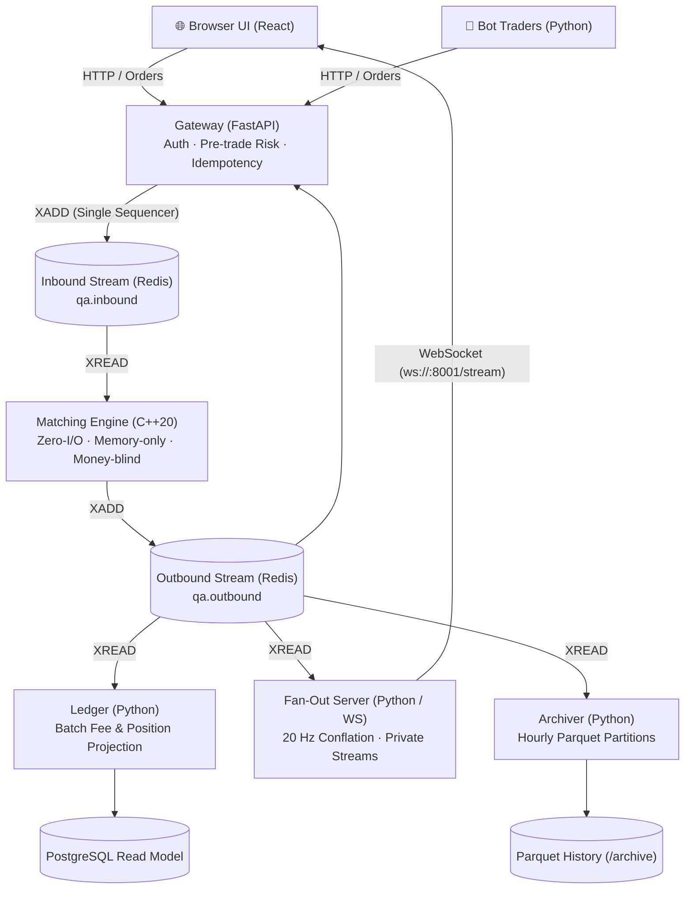

# Quant Arena

**A real-time simulated stock exchange, quantitative research platform, and market data system.**

Quant Arena simulates a full-featured electronic exchange from the ground up: accounts receive virtual capital, place buy and sell orders across ten simulated instruments, and a single-writer C++ matching engine executes trades under strict price-time priority. An append-only event stream powers real-time market data fan-out, asynchronous balance settlement, deterministic crash recovery, and reproducible backtesting.

---

## 1. Quickstart (From Clone to Trading in < 10 Minutes)

### Prerequisites
- [Docker Desktop](https://www.docker.com/products/docker-desktop/) (Docker Compose v2)
- Node.js 18+ (for the frontend web UI)

### 1. Start the Exchange Stack
```bash
git clone https://github.com/AviralSharma11/quant-arena.git
cd quant-arena

# Start all core services (Redis, PostgreSQL, Gateway, C++ Matcher, Ledger, Fan-Out, Archiver)
docker compose up --build -d
```

### 2. Verify System Health and Configuration
```bash
# Check that all containers are healthy
docker compose ps

# Audit configuration hash agreement across all services
docker compose logs gateway | grep config_hash
```

### 3. Start the Live Market Robot Traders
Bring the exchange to life with designated market makers and liquidity noise bots:
```bash
QA_BOT_PASSWORD=quant_arena_dev_password docker compose --profile bots up -d --build
```

### 4. Launch the Web Trading Interface
```bash
cd web
npm install
npm run dev
```
Open **http://localhost:5173** in your browser:
1. Register a new user account (automatically receives 10,000,000,000 virtual ticks).
2. Watch the live 20 Hz conflated L2 order book and real-time trade tape stream.
3. Submit limit or market orders on symbols `QAA` through `QAJ`.
4. Open the `/backtest` screen to backtest an SMA crossover strategy against historical data.

---

## 2. Architecture: One Project, Separate Processes, One Flow of Events

Quant Arena is architected as **one unified repository split into separate specialized processes sharing a single ordered stream of events**.



### Why Separate Processes?
Each process has a fundamentally different execution and scaling profile:
- **Gateway (Port 8000):** Fast asynchronous HTTP ingestion. Owns in-memory pre-trade risk reservations to prevent double-spending without database locks.
- **Matching Engine (C++20):** **Zero I/O**, single-threaded, and completely money-blind. Matches crossing orders in **166 nanoseconds (p50)**.
- **Ledger:** Off the fast path. Projects raw fill events into relational account balances and maker/taker fees in PostgreSQL.
- **Fan-Out (Port 8001):** Conflates order book updates at 20 Hz (50 ms windows) to broadcast full L2 book snapshots without overloading browsers or slowing down the sequencer.
- **Archiver:** Writes outbound events into partitioned Parquet files for long-term quantitative storage.

---

## 3. Settled Architectural Decisions ("Why Not?")

Every technology choice in Quant Arena was made deliberately to solve a specific problem while rejecting unnecessary operational complexity:

| Technology Omitted | What We Use Instead | Architectural Rationale |
|---|---|---|
| **Kafka** | **Redis Streams** | Quant Arena has a single sequencer/producer on a single box. Redis Streams provides microsecond-level append-only logging without Kafka's multi-node broker overhead and JVM complexity. |
| **Kubernetes** | **Docker Compose** | The system runs on a single host. Docker Compose provides deterministic local startup and clear restart policies without weeks of K8s orchestration overhead. |
| **Protobuf / Cap'n Proto** | **Fixed-size C++ Structs (`contracts.hpp` / `contracts.py`)** | Variable-width framing introduces serialization overhead. Quant Arena generates fixed-size packed binary POD records directly from `schema.toml`. |
| **OpenTelemetry** | **`scripts/trace.py`** | In an event-sourced architecture, **the event stream is the trace**. Any order's complete journey through every service can be reconstructed from its `client_order_id`. |
| **Prometheus / Grafana** | **Structured Logs + Offline Plots** | Live operations dashboards add heavy runtime footprints. Quant Arena logs structured JSON with `config_hash` and generates publication-grade offline performance plots. |
| **JWT Tokens** | **Redis Session Cookies** | JWTs cannot be revoked instantly without a shared revocation list. Redis-backed `httpOnly` session cookies allow immediate invalidation and strict browser security. |

---

## 4. Correctness, Invariants, and Determinism

An electronic exchange cannot merely be fast; it must be **provably correct**.

### The Permanent Differential Oracle
Quant Arena maintains two completely independent matching engine implementations:
1. **Naive Python Model (`engine/naive_model.py`):** An un-optimized, 200-line model that re-sorts a plain list on every operation.
2. **Optimized C++ Engine (`engine/cpp/order_book.cpp`):** A high-performance price-level order book with intrusive time-priority lists and O(1) cancel maps.

Under Hypothesis property-based testing (`tests/test_task_4_1.py`), both engines were subjected to **10,000+ generated order sequences** and produced **byte-identical event streams**.

### System Invariants Checked at Every Step
- **I1 (No Crossed Book):** Best bid is strictly lower than best ask.
- **I2 (Quantity Conservation):** Total order quantity equals filled quantity plus remaining resting quantity.
- **I3 (No Overfill):** Fills never exceed requested quantity.
- **I4 (Cancelled Orders Never Fill):** Once cancelled, an order never executes.
- **I5 (Price-Time Priority):** An independent auditor verifies no earlier or better-priced order was skipped.
- **I6 (Strictly Positive Quantities):** Resting quantities are always positive.
- **I7 (Deterministic Replay):** Identical input sequences always produce identical output events.
- **Cash Conservation:** `Total User Cash + Reserved Cash + House Fee Account = Initial Capital + Deposits`.

---

## 5. Performance & Benchmarking

Quant Arena benchmarks performance honestly using **open-loop load testing** to eliminate *coordinated omission* (measuring latency from the intended send time, not the delayed actual send time).

Full benchmark report: [`benchmarks/results/7.4-benchmark-report.md`](benchmarks/results/7.4-benchmark-report.md)

### Key Performance Findings

```
Component Latency Breakdown:
┌────────────────────────────────────────────────────────┐
│ Conflation Broadcast Window (Fan-Out): ~50.0 ms (99%)  │
├────────────────────────────────────────────────────────┤
│ Gateway Ingestion & Async Event Loop: ~3.0 - 6.0 ms    │
├────────────────────────────────────────────────────────┤
│ Redis Inbound/Outbound Stream Pipeline: ~0.8 - 1.5 ms  │
├────────────────────────────────────────────────────────┤
│ C++ Matching Engine Execution: 0.000166 ms (0.002%)    │
└────────────────────────────────────────────────────────┘
```

- **B1 Native Engine Throughput:** Matching loop runs at **166 ns p50** (~6,000,000 orders/sec single-core).
- **B2 End-to-End System Throughput:** Sustained open-loop knee observed at **200–300 orders/sec** through the complete FastAPI -> Redis -> C++ -> Redis -> FanOut pipeline on a single host.
- **Private Frame Optimization:** Private fills bypass the 50 ms conflation window (Open Issue 006), delivering personal fill notifications to the browser at **p50: 3.4 ms**.

---

## 6. Where the Prices Come From

The ten simulated instruments (`QAA` through `QAJ`) replay the recorded, anonymized 1-minute price history of real cryptocurrency assets pinned in `data/market_history.parquet`.
- **Replay Clock:** 1 real second = 1 simulated minute (a full trading day replays in 24 minutes).
- **Designated Market Makers:** Quoting bots maintain two-sided liquidity within a defined spread obligation and skew quotes against their own inventory to prevent one-sided accumulation.
- **Reproducibility:** Pinned by SHA-256 in `config/quant_arena.toml`.

---

## 7. Operations, Backups, and Tracing

- **Operations Runbook:** [`RUNBOOK.md`](RUNBOOK.md) — Comprehensive guide covering startups, service maps, diagnostic procedures, and failure modes.
- **Definition of Done:** [`DEFINITION_OF_DONE.md`](DEFINITION_OF_DONE.md) — Item-by-item scorecard walking every product and engineering goal with attached evidence.
- **PostgreSQL Read-Model Backup:**
  ```bash
  ./scripts/backup_postgres.sh
  ```
- **Order Tracing Tool:**
  ```bash
  python scripts/trace.py <CLIENT_ORDER_ID>
  ```

---

## 8. Definition of Done & Stated Misses

Quant Arena follows a policy of strict literal assessment. Items not achieved in Phase 1 are stated plainly rather than reinterpreted:

1. **No Public Cloud Deployment (Task 3.3):** The deployment half of Task 3.3 was placed on hold pending external VM/domain provisioning. The system runs in local containerized mode.
2. **Matcher Exception Handling (HANDOFF §3a):** `CppMatcher.run()` in Python does not catch Redis connection drops. If Redis restarts, the matcher container remains "healthy" while the process is halted.
3. **Healthy-but-Idle Detection:** Container healthchecks verify service connectivity, not stream progress. Monitoring requires sampling `XLEN qa.inbound` over time.
4. **Single-Host Benchmark Scope:** All benchmark suites were executed on a single host machine rather than a geographically separated network topology.

---

## 9. Key Documentation Reference

| Document | Purpose |
|---|---|
| [`ARCHITECTURE.md`](ARCHITECTURE.md) | Plain-language architecture guide with Mermaid flowcharts |
| [`RUNBOOK.md`](RUNBOOK.md) | Operational runbook for deploying, monitoring, and debugging |
| [`DEFINITION_OF_DONE.md`](DEFINITION_OF_DONE.md) | Formal Phase 1 definition-of-done checklist and scorecard |
| [`STATUS.md`](STATUS.md) | Project status board and decision log |
| [`WEEKLY_PLAN.md`](WEEKLY_PLAN.md) | Detailed 7-week execution plan and developer split |
| [`benchmarks/results/7.4-benchmark-report.md`](benchmarks/results/7.4-benchmark-report.md) | Full performance benchmark report (B1, B2, B3, Conflation) |
| [`open-issues/`](open-issues/) | Design history and decision records (001–019) |
